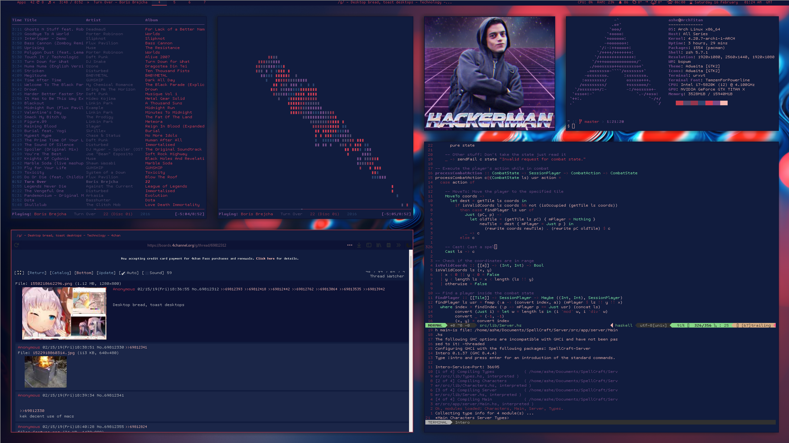

# Dotfiles

### Simply extract to your home directory.

> ### In preview:
* [bspwm](https://github.com/baskerville/bspwm)
* [polybar](https://github.com/jaagr/polybar)
* [ncmcpp](https://github.com/arybczak/ncmpcpp)
* [feh](https://github.com/derf/feh)
* [neovim](https://neovim.io/)
* [urxvt](https://wiki.archlinux.org/index.php/Rxvt-unicode)
* [firefox](https://firefox.com) with [custom css](https://github.com/Ashe/dotfiles/tree/master/.css)
